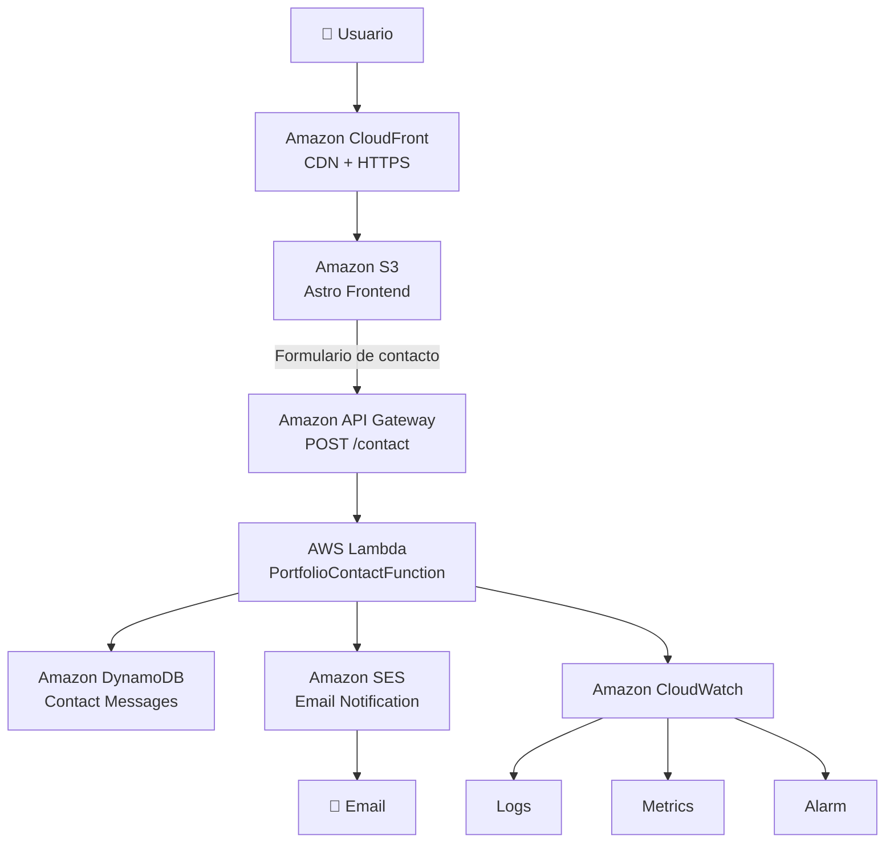

# ☁️ AWS Serverless Portfolio

Portfolio profesional desarrollado con **Astro, React, TypeScript y Tailwind CSS**, desplegado sobre una arquitectura **serverless en Amazon Web Services (AWS)**.

El proyecto fue desarrollado con el objetivo de aplicar y demostrar conocimientos de **Cloud Computing, desarrollo frontend, arquitecturas serverless, seguridad, CI/CD, observabilidad y optimización de costos en AWS**.

🌐 **Portfolio:** https://d14d15ny7dn320.cloudfront.net/

---

## 🛠️ Tecnologías


---

# 🏗️ Arquitectura

La aplicación utiliza una arquitectura principalmente **serverless**, separando el frontend estático, la distribución de contenido y los servicios backend.



Además, la infraestructura utiliza servicios transversales para seguridad, automatización y control de costos:

```text
AWS IAM
   ↓
Control de acceso y permisos

GitHub Actions + AWS OIDC
   ↓
CI/CD y despliegue automatizado

AWS Budgets
   ↓
Monitoreo y control de costos
```

---

# 🎨 Frontend

El frontend fue desarrollado utilizando:

- **Astro 7**
- **React 19**
- **TypeScript**
- **Tailwind CSS**
- **Framer Motion**

Astro genera una versión estática optimizada del portfolio mediante:

```bash
npm run build
```

El resultado se genera en:

```text
dist/
```

Este contenido es posteriormente desplegado en Amazon S3.

---

# 🪣 Amazon S3

Amazon S3 funciona como almacenamiento del frontend estático generado por Astro.

El bucket contiene únicamente los archivos generados durante el proceso de build:

```text
dist/
├── index.html
├── _astro/
├── blog/
├── favicon.svg
├── robots.txt
└── ...
```

El bucket **no se encuentra expuesto públicamente directamente a Internet**.

El acceso al contenido se realiza mediante Amazon CloudFront.

Esto permite mantener:

```text
Internet
   ↓
CloudFront
   ↓
S3 privado
```

en lugar de:

```text
Internet
   ↓
S3 público ❌
```

---

# 🌎 Amazon CloudFront

Amazon CloudFront funciona como **CDN (Content Delivery Network)** del portfolio.

Sus principales responsabilidades son:

- Distribuir el contenido estático.
- Servir el sitio mediante HTTPS.
- Cachear archivos cerca de los usuarios.
- Reducir accesos directos al bucket.
- Proporcionar una URL pública para acceder al portfolio.

Actualmente el sitio se encuentra disponible en:

**https://d14d15ny7dn320.cloudfront.net/**

El objeto raíz configurado es:

```text
index.html
```

CloudFront tiene autorización para acceder al bucket privado de S3, evitando la necesidad de habilitar acceso público al bucket.

---

# 📬 Formulario de contacto Serverless

El portfolio incorpora un formulario de contacto conectado con AWS.

El flujo es:

```text
Usuario
   ↓
Formulario Astro
   ↓
POST /contact
   ↓
Amazon API Gateway
   ↓
AWS Lambda
   ├──→ DynamoDB
   └──→ Amazon SES
```

El formulario solicita:

```text
Nombre
Email
Asunto
Mensaje
```

El frontend envía la información en formato JSON hacia API Gateway.

---

# 🔌 Amazon API Gateway

Amazon API Gateway expone el endpoint HTTP utilizado por el formulario.

Ruta implementada:

```http
POST /contact
```

API Gateway recibe la solicitud proveniente del frontend y ejecuta la función Lambda encargada de procesarla.

También se configuró **CORS** para permitir solicitudes desde el frontend autorizado.

Esto permite desacoplar completamente el frontend del backend.

---

# ⚡ AWS Lambda

La lógica backend se ejecuta mediante una función AWS Lambda.

La función:

```text
PortfolioContactFunction
```

es responsable de:

1. Recibir el request desde API Gateway.
2. Interpretar el JSON recibido.
3. Validar los campos.
4. Generar un identificador único.
5. Registrar la fecha del mensaje.
6. Guardar el contacto en DynamoDB.
7. Enviar una notificación mediante Amazon SES.
8. Registrar información de ejecución en CloudWatch.
9. Devolver la respuesta HTTP al frontend.

Una solicitud procesada correctamente devuelve:

```http
HTTP 201 Created
```

Esto permite ejecutar el backend sin mantener servidores EC2 permanentemente activos.

---

# 🗄️ Amazon DynamoDB

Los mensajes enviados mediante el formulario se almacenan en **Amazon DynamoDB**.

Tabla utilizada:

```text
PortfolioContactMessages
```

Cada contacto almacena información similar a:

```json
{
  "id": "UUID",
  "name": "Nombre",
  "email": "email@example.com",
  "subject": "Asunto",
  "message": "Mensaje",
  "createdAt": "ISO-8601 timestamp"
}
```

DynamoDB fue elegido por su integración natural con Lambda y por adaptarse correctamente a una arquitectura serverless con bajo volumen de tráfico.

---

# 📧 Amazon SES

Amazon Simple Email Service (**SES**) se utiliza para generar una notificación cuando alguien completa el formulario.

El flujo es:

```text
Nuevo contacto
      ↓
    Lambda
      ↓
 Amazon SES
      ↓
Notificación por email
```

La dirección utilizada como identidad de envío fue previamente verificada en Amazon SES.

Además, el email ingresado por el visitante se utiliza como **Reply-To**, permitiendo responder directamente al contacto recibido.

De esta forma el mensaje:

- queda almacenado en DynamoDB;
- y genera una notificación por correo electrónico.

---

# 📊 Amazon CloudWatch

Amazon CloudWatch proporciona observabilidad sobre el backend.

Lambda registra automáticamente información de ejecución en:

```text
/aws/lambda/PortfolioContactFunction
```

Se utilizan tres componentes principales:

### Logs

Permiten revisar:

```text
Invocaciones
Mensajes procesados
Errores
Ejecuciones de SES
Ejecuciones de DynamoDB
```

### Metrics

CloudWatch permite monitorear métricas de Lambda como:

```text
Invocations
Errors
Duration
Throttles
Concurrent executions
```

### Alarm

Se configuró una alarma para detectar errores en la función Lambda.

Conceptualmente:

```text
Lambda
   ↓
Errors >= 1
   ↓
CloudWatch Alarm
   ↓
ALARM
```

Actualmente la alarma funciona como mecanismo de monitoreo sin notificaciones SNS.

---

# 🔐 AWS IAM

AWS Identity and Access Management (**IAM**) controla los permisos utilizados por los distintos componentes.

La función Lambda utiliza un **Execution Role** con permisos específicos para acceder únicamente a los servicios necesarios.

Conceptualmente:

```text
PortfolioContactFunction
        ↓
      IAM Role
     ↙    ↓    ↘
DynamoDB SES CloudWatch
```

Se evita utilizar credenciales AWS directamente dentro del código fuente.

---

# 🔒 S3 privado + CloudFront

Una decisión importante de seguridad fue evitar publicar directamente el bucket S3.

La arquitectura utiliza:

```text
Usuario
   ↓
CloudFront
   ↓
Origin Access
   ↓
S3 privado
```

La política del bucket permite que CloudFront lea los objetos correspondientes sin habilitar acceso público general.

Esto mantiene separadas:

- la capa pública de distribución;
- y la capa privada de almacenamiento.

---

# 🚀 CI/CD con GitHub Actions

El deployment está automatizado utilizando **GitHub Actions**.

Cada vez que se realiza:

```bash
git push
```

sobre la rama:

```text
main
```

se ejecuta automáticamente el workflow de deployment.

Flujo:

```text
Developer
    ↓
git push
    ↓
GitHub
    ↓
GitHub Actions
    ↓
npm ci
    ↓
npm run build
    ↓
dist/
    ↓
Amazon S3
    ↓
CloudFront Invalidation
    ↓
Nueva versión publicada
```

Esto elimina la necesidad de subir manualmente cada nueva versión del portfolio a S3.

---

# 🔑 GitHub Actions + AWS OIDC

La autenticación entre GitHub Actions y AWS utiliza **OpenID Connect (OIDC)**.

Esto permite evitar almacenar:

```text
AWS_ACCESS_KEY_ID
AWS_SECRET_ACCESS_KEY
```

como secretos permanentes dentro del repositorio.

El flujo de autenticación es:

```text
GitHub Actions
      ↓
OIDC Token
      ↓
AWS STS
      ↓
AssumeRoleWithWebIdentity
      ↓
IAM Role
      ↓
Credenciales temporales
```

GitHub obtiene credenciales temporales exclusivamente durante la ejecución del workflow.

Esta configuración mejora la seguridad del pipeline CI/CD.

---

# 🔄 Deployment

El workflow realiza principalmente:

```text
Checkout repository
        ↓
Setup Node.js
        ↓
npm ci
        ↓
npm run build
        ↓
Configure AWS Credentials (OIDC)
        ↓
aws s3 sync
        ↓
CloudFront Invalidation
```

Después de actualizar S3 se genera una invalidación:

```text
/*
```

para evitar que CloudFront continúe sirviendo una versión anterior del sitio desde caché.

---

# 💰 AWS Budgets

El proyecto fue diseñado priorizando una arquitectura de **bajo costo**.

AWS Budgets permite monitorear el gasto acumulado de la cuenta.

Se configuraron alertas de referencia para:

```text
USD 2
USD 3
USD 5
```

El objetivo es mantener el proyecto alrededor de un máximo aproximado de:

```text
USD 5 / mes
```

La arquitectura aprovecha servicios serverless y modelos de pago por uso para evitar mantener infraestructura activa innecesariamente.

---

# 💡 Decisiones de arquitectura

El proyecto busca aplicar varias buenas prácticas cloud.

### Serverless

El backend utiliza:

```text
API Gateway
Lambda
DynamoDB
SES
```

evitando mantener servidores permanentemente ejecutándose.

### Seguridad

Se implementaron:

```text
S3 privado
CloudFront
IAM Roles
OIDC
Credenciales temporales
CORS
```

### Automatización

GitHub Actions automatiza completamente el proceso:

```text
Código → Build → AWS → Producción
```

### Observabilidad

CloudWatch proporciona:

```text
Logs
Metrics
Alarms
```

### Optimización de costos

Se priorizaron servicios con:

```text
Pay-per-use
Serverless
Free Tier cuando corresponde
Sin EC2 permanente
Sin WAF para el tráfico actual
AWS Budgets
```

---

# 🧑‍💻 Desarrollo local

Clonar el repositorio:

```bash
git clone https://github.com/MiliCallejo/aws-serverless-portfolio.git
```

Ingresar al proyecto:

```bash
cd aws-serverless-portfolio
```

Instalar dependencias:

```bash
npm install
```

Ejecutar el servidor de desarrollo:

```bash
npm run dev
```

Astro estará disponible normalmente en:

```text
http://localhost:4321
```

---

# 📦 Build

Generar una versión de producción:

```bash
npm run build
```

El resultado se genera dentro de:

```text
dist/
```

También puede probarse localmente mediante:

```bash
npm run preview
```

---

# 📁 Estructura principal

```text
aws-serverless-portfolio/
│
├── .github/
│   └── workflows/
│       └── deploy.yml
│
├── public/
│
├── src/
│   ├── components/
│   │   ├── ContactSection.tsx
│   │   ├── ExperienceSection.tsx
│   │   ├── GlassHeader.tsx
│   │   ├── HeroSection.tsx
│   │   ├── ProjectsSection.tsx
│   │   └── SkillsSection.tsx
│   │
│   ├── layouts/
│   ├── lib/
│   ├── pages/
│   └── styles/
│
├── astro.config.ts
├── package.json
├── tsconfig.json
└── README.md
```

---

# 📚 Conocimientos aplicados

Este proyecto permitió poner en práctica conocimientos relacionados con:

- Arquitecturas Cloud.
- AWS Serverless.
- Amazon S3.
- Amazon CloudFront.
- AWS Lambda.
- Amazon API Gateway.
- Amazon DynamoDB.
- Amazon SES.
- Amazon CloudWatch.
- AWS IAM.
- AWS STS.
- OpenID Connect.
- GitHub Actions.
- CI/CD.
- AWS Budgets.
- Seguridad Cloud.
- APIs REST/HTTP.
- Astro.
- React.
- TypeScript.
- Tailwind CSS.

---

# 🎯 Objetivo del proyecto

El objetivo no fue únicamente publicar un portfolio, sino utilizarlo como un proyecto práctico para diseñar e implementar una solución cloud completa.

Partiendo de un frontend estático, el proyecto evolucionó incorporando:

```text
Hosting
   ↓
CDN
   ↓
Seguridad
   ↓
Backend Serverless
   ↓
Persistencia
   ↓
Email
   ↓
Observabilidad
   ↓
CI/CD
   ↓
Control de costos
```

El resultado es una aplicación funcional desplegada sobre AWS que integra frontend, backend, automatización, seguridad y monitoreo.

---

# 👩‍💻 Autor

**Milagros Callejo**

Analista Funcional ERP | AWS Cloud Developer

[LinkedIn](https://www.linkedin.com/in/milagroscallejo/) · [GitHub](https://github.com/MiliCallejo) · [Portfolio](https://d14d15ny7dn320.cloudfront.net/)

---

## 📄 Licencia

Este proyecto se encuentra disponible bajo la licencia incluida en el repositorio.